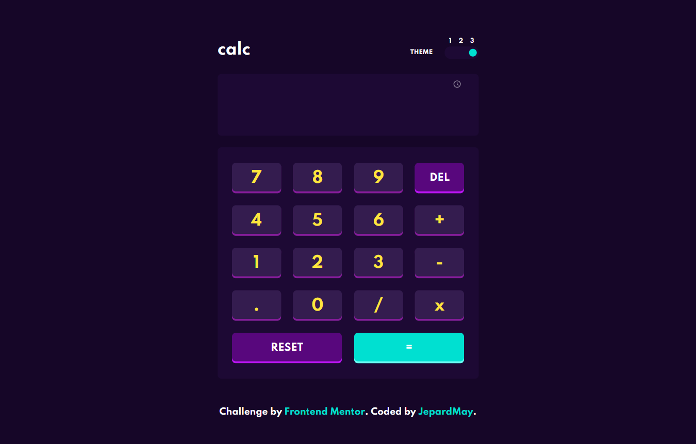
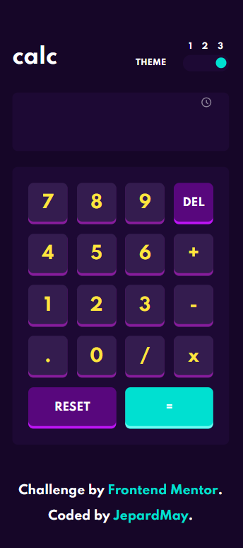

# Frontend Mentor - Calculator app solution

This is a solution to the [Calculator app challenge on Frontend Mentor](https://www.frontendmentor.io/challenges/calculator-app-9lteq5N29). Frontend Mentor challenges help you improve your coding skills by building realistic projects. 

## Table of contents

- [Overview](#overview)
  - [The challenge](#the-challenge)
  - [Screenshots](#screenshot)
  - [Links](#links)
  - [Available Scripts](#available-scripts)
- [My process](#my-process)
  - [Built with](#built-with)
  - [What I learned](#what-i-learned)
  - [Continued development](#continued-development)
- [Author](#author)

## Overview

### The challenge

Users should be able to:

- See the size of the elements adjust based on their device's screen size
- Perform mathematical operations like addition, subtraction, multiplication, and division
- Adjust the color theme based on their preference
- **Bonus**: Have their initial theme preference checked using `prefers-color-scheme` and have any additional changes saved in the browser

### Screenshot

 

### Links

- Solution URL: [Frontend Mentor](https://www.frontendmentor.io/solutions/calculator-app-on-react-ts-O43gwkmvbp)
- Live Site URL: 
  - [Netlify](https://super-squirrel-a6294c.netlify.app/)

### Available Scripts

In the project directory, you can run:

- #### `npm start`
- #### `npm test`
- #### `npm run build`

## My process

### Built with

- [React](https://github.com/facebook/create-react-app)
- SASS styling
- TypeScript
- Mobile-first workflow

### What I learned

Developing this project, I learned how to set up React context and how to create custom hooks. Here I created useDraggable hook that allows to move an element by mouse or touch move. I also learned more about working with TypeScript in React.

### Continued development

In my next projects, I want to deepen my understanding of intermediate and advanced concepts in React and TypeScript.

## Author

- GitHub - [Veronika Palto](https://github.com/JepardMay)
- Frontend Mentor - [@JepardMay](https://www.frontendmentor.io/profile/JepardMay)
